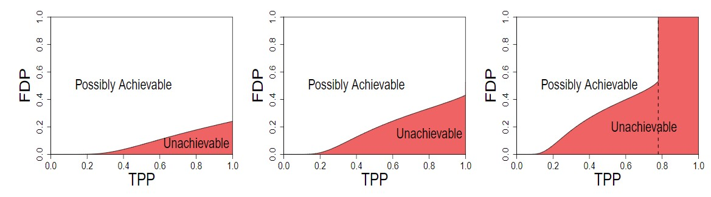
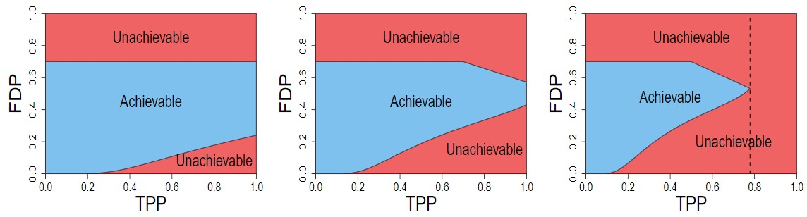

This project describes the result from my paper 
[The Complete Lasso Trade-off Diagram](https://arxiv.org/abs/2007.11078)
by Hua Wang, Yachong Yang, Zhiqi Bu, Weijie J. Su.

# The Problem of Interest
Using Approximate Message Passing (AMP) algorithm, we can characterize the Lasso solution's distribution, and therefore describe interesting statistics such as the estimation error (MSE between true beta and estimated beta), true positive proportion (TPP), false discovery proportion (FDP), etc. In [2015](https://arxiv.org/abs/1511.01957), it has been shown that when the sparsity of signal is too high or when the sampling ratio (the ratio of sample size to feature size) is too low, the Donoho-Tanner phase transition occurs, in the sense that (1) there is a trade-off curve between TPP and FDP; (2) TPP has an upper limit, regardless of how one tunes the penalty parameter. However, that paper described which (TPP,FDP) pair is NOT achievable but did not fully address which is achievable. We answer this remaining question.

## Before our work, 2015

## Our work, 2020


An important implication of our result is that, in some cases, high TPP automatically guarantees low FDP for Lasso.

# Description of Files
If you want to plot the complete Lasso TPP-FDP trade-off diagram, all you need to change is line 98 and 99 for different sparsity (eps) and sampling ratio (delta).

## Citation
```
@article{wang2020complete,
  title={The Complete Lasso Tradeoff Diagram},
  author={Wang, Hua and Yang, Yachong and Bu, Zhiqi and Su, Weijie},
  journal={Advances in Neural Information Processing Systems},
  volume={33},
  pages={20051--20060},
  year={2020}
}
```
